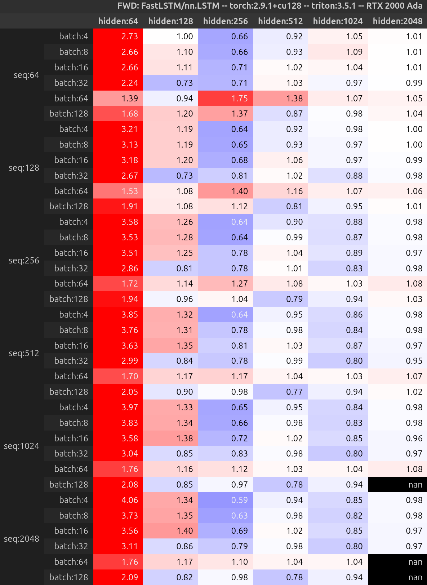
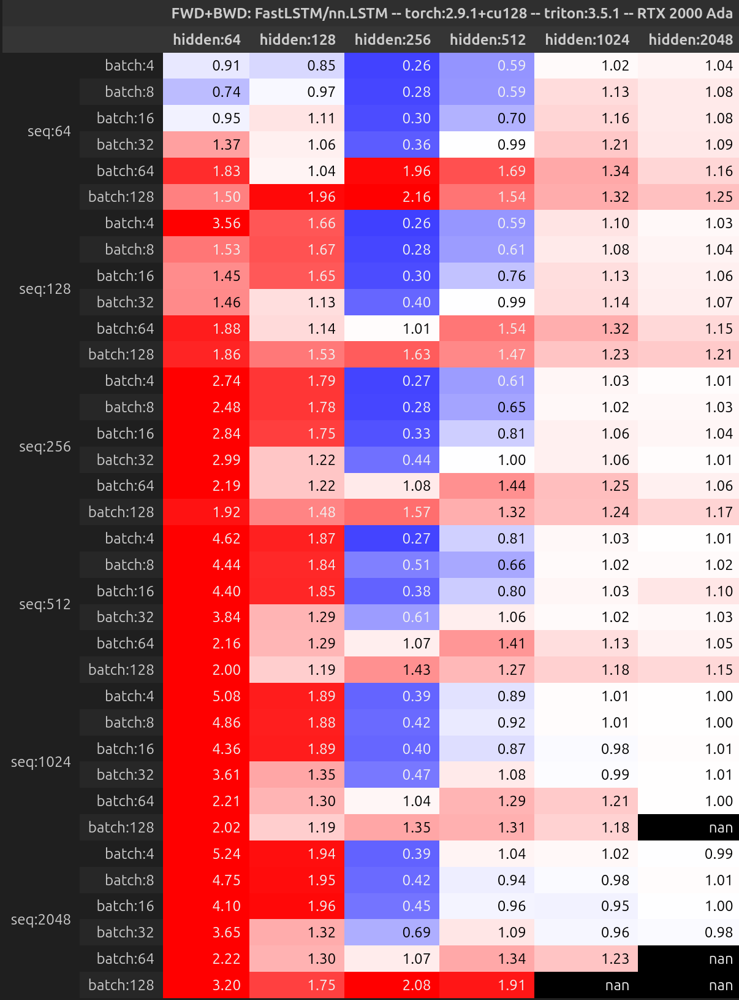
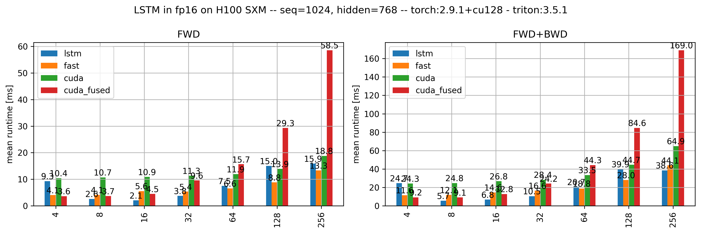

## FastLSTM
Why implement an LSTM in 2025? Mostly as an exercise to improve my gpu programming and algorithmic reasoning skills given the non-trivial dependency structure within an LSTM. There also wasn't, to the best of my knowledge, a fast open source LSTM implementation.

This repo attempts to provide an reasonably performant LSTM implementation using pytorch and triton. The next section contains a speed comparison with `nn.LSTM`. Next, we go into the implementation details beginning with the relevant equations, followed by comments about the high-level design choices.

### Benchmarking
The tables below compare median runtimes, computed with `triton.testing.do_bench` on an RTX 2000 Ada gpu, between `FastRNN` and `nn.LSTM` in single precision.

More figures and the raw data can be found in `./figures`.

### FWD

### FWD+BWD

### Caveat
The numbers here are not perfectly correlated with the iterations/second produced in `scripts/overfit.py`.

### Half precision
When re-running the benchmark without re-tuning the kernels and the graph/persistent kernel boundary I find:

- In the forward pass, there are up to 30\% gains when using bf16 or fp16 in FastLSTM
- Combining forward and backward pass, the gains are order 40\%
- `nn.LSTM` in full bfloat16 seems broken: it runs in most configurations a few times slower than the single precision version. fp16 version runs as expected. Using `torch.autocast` alleviates the issue
- `nn.LSTM` gains slightly more from fp16 than `FastLSTM` but that might be down to the lack of re-tuning

I have not investigated lower precision such as fp8 or even lower dtypes.

### The maths
An [LSTM](https://ieeexplore.ieee.org/abstract/document/6795963) is a recurrent neural net that can't be (fully) parallelised. The forward pass is given by:

- $i_t = \sigma(W_{ii} x_t + b_{ii} + W_{hi} h_{t-1} + b_{hi}) \equiv \sigma(pi_t)$
- $f_n = \sigma(W_{if} x_t + b_{if} + W_{hf} h_{t-1} + b_{hf}) \equiv \sigma(pf_t)$
- $g_n = \text{tanh}(W_{ig} x_t + b_{ig} + W_{hg} h_{t-1} + b_{hg}) \equiv \sigma(pg_t)$
- $o_n = \sigma(W_{io} x_t + b_{io} + W_{ho} h_{t-1} + b_{ho}) \equiv \sigma(po_t)$
- $c_n = f_t \cdot c_{t-1} + i_t \cdot g_t$
- $h_n = o_t \cdot \text{tanh}(c_t)$

Where: $x$ is the input to the LSTM, $W_{i x}, b_{i x}$ are the input-hidden weights and biases, $c_t$ is the cell state ($c_0$ needs to be provided as input to net), similarly $h_t$ is the hidden/output state and $h_0$ is a relevant initial condition. $W_{h x}$ and $b_{h x}$ are the corresponding weights and biases.

To simplify things, we'll define $W_x = [W^T_{ii}, W^T_{if}, W^T_{ig}, W^T_{io}]^T$ which has shape [4x hidden, input]. The same for $W_h$ with shape [4x hidden, hidden]. Let's also define $\text{ifgo} =W_x x + W_h h + b_x + b_h \equiv \tilde{\text{ifgo}} + W_h h$.

For the backward pass, the following derivaties are given: $d \text{out}$, $d h_n$ and $d c_n$. The goal is to apply the chain rule in order to compute the derivatives of the inputs to the LSTM as well as the weights. Remember $d \sigma(x) = \sigma(x) (1- \sigma(x)) dx$ and $d \text{tanh}(x) = (1- \text{tanh}^2(x)) dx$.

- $d h_t = d h_t + d h_{t+1}$ - what this means is the hidden state at a point in time gets gradient contribution from the next layers as well as the next time step
- $d c_t = d c_t + d h_t \sigma(po_t) (1- \text{tanh}^2(c_t))$
- $d po_t = d h_t \text{tanh}(c_t) \sigma(po) * (1-\sigma(po))$
- $d c_{t-1} = d c_t \sigma(pf_t)$
- $d pi_{t} = d c_t \text{tanh}(pg_t) ( 1- \text{tanh}^2(pg_t))$
- $d pg_{t} = d c_t \sigma(pi_t) (1 - \text{tanh}^2(pg_t))$
- $d \text{ifgo} = [d pi, d pf, d pf, d po]$
- $d h_{t-1} = d \text{ifgo}_t W_h$
- $d x_t = d \text{ifgo}_t W_x$
- $d Wx += d \text{ifgo}_t^T x$
- $d Wh += d \text{ifgo}_t^T h_{t-1}$
- $d b_{x|h} += d \text{ifgo}_t.sum(\text{batch})$

### Implementing the fwd pass
We begin by computing $\tilde{\text{ifgo}} = Wx + bx + bh$ which is parallelisable and thus straightforward. Note: Rnns use by default tf32 (`torch.backends.cudnn.rnn.fp32_precision = "tf32"`), you need to turn this explicitly on for matmuls in order to be competitive.

Next, we need to work on the second, non-parallelisable components of $\text{ifgo} = \tilde{\text{ifgo}} + W_h h_{t-1}$. In addition to the recurrence, the last term also introduces channel mixing. This requires synchronization in the channel dimension at every time step. There are (at least) two ways to implement this:

- using a one time step kernel that gets called n-times, synchronization occurs naturally between kernel launches
- using a persistent kernel approach where the seq_len loop is within the kernel and the channel sync is implemented by atomics

Trade-offs:

- with the one step kernel, we need to pay n launch overheads. This can be mitigated by using cuda graphs (but you still pay the capture once). The advantage is that each such kernel is close to a standard matmul and thus efficient
- using persistent kernels, we only pay the launch overhead once and don't need to capture the kernel either. The dowside is that you might not use all resouces efficiently (eg. how to tile your (`batch-size`, `hidden-size`) problem in a way to fully use 22 SMs on a RTX 2000 Ada?). In addition, for large `hidden-size`s you might need to work with suboptimal tiles (long hidden and short batch chunks) in order to prevent deadlocks.
- In practice, the persistent kernel does well for smaller problem sizes and the graph for larger. So you kind of want to combine both.

To finish the forward pass, we need to fuse all non-linearities and pointwise operations into this aforementioned kernels.

### Implementing the bwd pass
To avoid recomputations, we first need to decide what parts of the forward pass we want to reuse. Looking at the derivatives points to $\text{ifgo}$ as a good choice.

Let's start with $Wgrad$: These computations are not relevant for the backpropagation through time, so it's fine to store the relevant intermediate values and perform a large matrix multiplication in the end.

$Dgrad$ has three components $d c_t, d h_t, d x_t$. Out of those, $d x_t$ is not required for the backpropagation through time. Moreover, we already store $d \text{ifgo}$ for $Wgrad$, so it also makes sense to defer this matmul to the very end where it can be done efficiently too.

To compute $d c_t$ and $d h_t$ there are again two types of kernels available: one-step and persistent with similar trade-offs as in the forward pass. In practice, the persistent version is more useful because the problem size turned from (`batch-size`, `4 hidden-size`) to (`batch-size`, `hidden-size`), i.e. there are fewer parallelisation options across SMs. Regarding the one-step kernel there is a small annoyance: in the forward pass we had channel-mixing followed by non-linearities and point-wise operations. In this order it's easy to fuse the two steps. In the backward pass it is naturally thye other way around which requires either an extra sync done by breaking the one-step kernel into two pieces: `h-grad` and then `ifgo-grad` or you 'shift the kernel by half a time step' and have some extra code for the boundary condition at the end and beginning of the sequence. The latter options runs slightly faster than the two kernel approach.

### Two triton learnings
- to use `autotune`, your kernels much be idempotent!
- use atomics to implement cross-program synchronization (but be careful with deadlocks)

### Limitations
- only tuned for RTX 2000 Ada
- `nn.LSTM` has extra options `bias`, `batch_first`, `dropout`, `bidirectional`, `proj_size` that `FastLSTM` doesn't support yet
- can't operate on `PackedSequence` input
- accuracy of half-precision might be suboptimal: I did not think carefully about whether some components need to remain in single precision
- doesn't exploit `num_layer` parallelisation dimension (which `nn.LSTM` does!)
- not battletested

### Related work
[FlashRNN](https://arxiv.org/abs/2412.07752) offers, among other things, a fast LSTM implementation in their [repo](https://github.com/NX-AI/flashrnn). However, as this reproduction of fig. 4 from the paper shows, it is possible to implement LSTMs more efficiently, even in triton.

